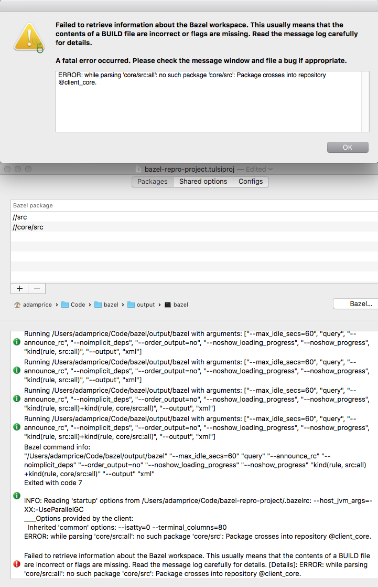
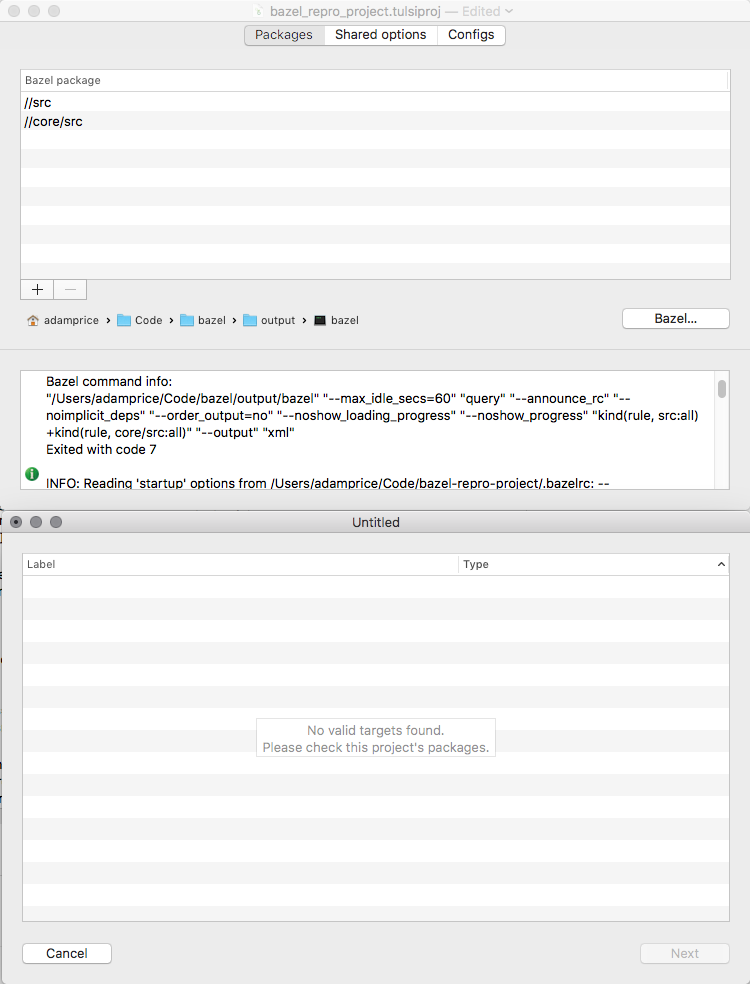
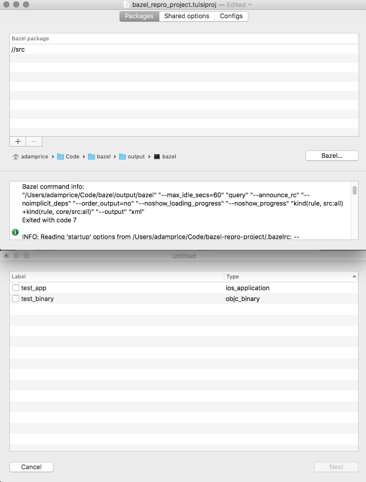

# Bazel/Tulsi Small Repro Project
## Tulsi Error: Cannot generate Tulsi project for ios_application that includes packages in other Bazel repositories

This is a requirement of our project, which is an iOS application that depends on a group of C++ libraries in a submodule.

To reproduce:

1. Use the latest version of Tulsi (0.4.150441607.20170317)
2. Open bazel_repro_project.tulsiproj
3. Click the + button to add a Bazel package
4. Select core/src/BUILD.bazel
5. Click Add

Expected result: The C++ package in core is added to the .tulsiconfig, which can then be used to generate a .xcodeproj for an iOS app depending on a C++ library.

Actual result: An error screen appears with the error: "ERROR: while parsing 'core/src:all': no such package 'core/src': Package crosses into repository @client_core."

Interestingly, after hitting this error, the `core/src` package remains in the list of Packages. If you then click on the Configs pane and click the + button, the popup that appears says "No valid targets found. Please check this project's packages."

If you go back to the Packages pane and delete `core/src`, and repeat the process, the correct `test_app` and `test_binary` checkboxes appear.

